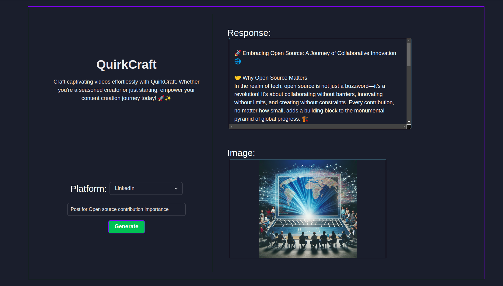

# QuirkCraft 🎭

Welcome to QuirkCraft, your creative powerhouse where imagination seamlessly transforms into compelling videos and captivating social media content! 🚀✨

## Overview

QuirkCraft harnesses the immense power of GPT-4 and DALL-E-3 to offer a comprehensive platform for crafting engaging video scripts and eye-catching thumbnails for YouTube, as well as punchy post captions with stunning images for LinkedIn, Facebook, and Twitter. 🎥🌟📸

### YouTube Video Generation

Transform your ideas into captivating 60-second masterpieces effortlessly. QuirkCraft takes your provided topic and generates both a dynamic video script and an attention-grabbing thumbnail for your YouTube content. 🎬✨ Let the brilliance of GPT-4 elevate your creativity, making video creation a breeze! 🚀🎨

### Social Media Content Creation

Extend your reach across platforms with QuirkCraft's social media content creation capabilities. Convert your topic into engaging post captions accompanied by a visually striking image tailored for LinkedIn, Facebook, and Twitter. Elevate your social media game with content that stands out and resonates! 🌐🖼️

## Future Endeavors

Stay tuned for upcoming features, as we're actively exploring the possibility of generating videos directly from the images created by DALL-E-3. QuirkCraft is committed to pushing the boundaries of creative expression, and I can't wait to bring you even more innovative tools for your content creation journey. 🚀🌈

Your creative sanctuary awaits at QuirkCraft—where your ideas become a captivating reality! ✨🎨

## UI Design



## Current progress

YouTube Video: [YouTube Example](./Examples/Youtube.mp4)
<br>
LinkedIn Post: [LinkedIn Example](./Examples/LinkedIn.mp4)

<br>

## Getting Started

1. Clone the repository
```bash
git clone https://github.com/HeetVekariya/QuirkCraft.git
```

2. Make virtual environment and activate it
```bash
python -m venv venv
source venv/bin/activate
```

3. Navigate to the project directory
```bash
cd QuirkCraft
``` 

4. Install the dependencies
```bash
pip install -r {path to requirements.txt}
reflex init
```

5. Add your OpenAI GPT-4 API key to the `state.py` file, replace `YOUR_API_KEY` with your API key.
```python
api_key = "YOUR_API_KEY"
```

6. Run the app
```bash
reflex run
```

Note : Must have GPT-4 API key to run the app, you can create [here](https://platform.openai.com/account/api-keys).

---

### Social Media Content Examples for Cryptocurrency Reality

| Platform              | Topic             | Textual output                      | Image Output                                        |
|-----------------------|--------------------------|-------------------------|-------------------------------------------------------------|
| YouTube               | Cryptocurrency Reality   | [Intro - 0:00-0:20]<br>[Host enters, animated background with cryptocurrency symbols]<br>Host: "Hey everyone! Ever wondered what the craze around cryptocurrency really is about? Today, we're diving into the digital coin conundrum! In the next 60 seconds, prepare to debunk myths and unveil the raw truth behind these virtual assets. Let's decode crypto reality!"<br><br>[Body - 0:21-0:40]<br>[Cut to infographics depicting crypto basics and common misconceptions]<br>Host: "Cryptocurrencies, like Bitcoin and Ethereum, are not just digital money. They're a tech revolution! Using blockchain, they allow secure and anonymous transactions. But remember, it's not all digital gold rushes; volatility and security concerns are part of the package."<br><br>[Conclusion - 0:41-0:60]<br>[Show real-life footage of people using cryptocurrency, market charts trending up and down]<br>Host: "The future seems in flux, yet crypto is undeniably shaping it. Whether it's a bubble or the next big thing, only time will tell. Before investing, do your research and be aware of the hype versus reality. Stay smart, stay informed, and keep watching for more truths unveiled!" |            |
| X(Twitter)               | Cryptocurrency Reality   | 🎢 Section 1: The Rollercoaster Journey of Cryptos 🚀<br>"From Bitcoin breakthroughs to bear market blues, #cryptocurrency has been the ultimate digital daredevil. 🎢💻 It's a world where 24/7, anything can happen, and the only guarantee is unpredictability. #CryptoReality #HODLstrong<br><br>🔍 Section 2: The Myths vs. The Facts 🧐<br>"Let's debunk some myths! 💬 #Cryptocurrency isn't just a trend, it's a financial revolution in the making. But remember, not all that glitters is gold. Do your research, understand the blockchain, and always invest wisely. 📈🔎 #CryptoFacts #InvestSmart<br><br>💡 Section 3: The Community and Culture 👥<br>"From meme coins to major movements, the #crypto community is vibrant, diverse, and always buzzing with innovation. Here's to the developers, dreamers, and doers shaping the future of finance. 🌐💚 #CryptoCulture #TogetherWeGrow<br><br>🌍 Section 4: The Bigger Picture 🌌<br>"As we navigate through the digital age, #cryptocurrency isn't just about making a quick buck. It's about decentralization, empowerment, and creating a world where financial freedom is accessible to all. ✊💫 #CryptoWorld #FinancialFreedom" |    |
| LinkedIn              | Cryptocurrency Reality   | 🚀 **Exploring the Realities of Cryptocurrency** 🚀<br><br>**A. The Digital Gold Rush**<br>In the digital age, cryptocurrency has emerged as the new frontier, ushering in a financial revolution. 🌐 Much like the gold rushes of the past, crypto promises opportunities, adventure, and of course, the allure of wealth. But what lies beneath the surface?<br><br>**B. Volatile yet Vivid**<br>Cryptocurrencies are renowned for their volatility. Prices can skyrocket 📈 or plummet 📉 in the blink of an eye. This wild ride is not for the faint-hearted. Yet, it's this same unpredictability that attracts investors and technophiles, seeking the next big wave.<br><br>**C. The Technology Tapestry**<br>Beyond the buzz and the boom-and-bust cycles, lies a robust technological framework. Blockchain - the backbone of cryptocurrency - offers a transparent, secure, and decentralized ledger. ⛓️ It's a testament to innovation and the endless human pursuit of efficiency and autonomy.<br><br>**D. Integration into Mainstream**<br>Slowly but surely, crypto is clawing its way into the mainstream. Businesses big and small are starting to accept these digital currencies, while governments are grappling with how to regulate them. 🏦⚖️ The question is not if, but when will crypto become as commonplace as the dollar or the euro?<br><br>**E. The Road Ahead**<br>The future of cryptocurrency is as enigmatic as its inception. Will it redefine our conception of money? Or is it a digital mirage, destined to fade away? 💭 Only time will tell. But one thing is certain – the crypto journey is one of the most intriguing episodes of the 21st century. 🌟<br><br>To the crypto-curious and avid blockchain believers, let's continue to watch this space. Innovation, disruption, and a bit of mystery—cryptocurrency has it all. ✨<br><br>#Cryptocurrency #Blockchain #DigitalEconomy #Innovation #FinTech |    |
| Facebook              | Cryptocurrency Reality   | 🚀👨‍💻 The Cryptoverse Unveiled! 🌐💸 Let's demystify the buzz surrounding the world of cryptocurrencies!<br><br>Part I: The Birth of a New Currency Era<br>"Are we truly witnessing a revolution in the making? 🌟 Bitcoin, Ethereum, and countless other digital currencies have taken the marketplace by storm. But it's more than just skyrocketing prices and tech buzzwords. It's about the power to redefine money as we know it. 🔗 Decentralized, secure, and borderless - cryptocurrencies promise a future where financial freedom is in our hands. #CryptoRevolution<br><br>Part II: Navigating the Waves of Volatility<br>"Buckle up for a rollercoaster ride! 🎢 It's not just about the highs; crypto can be a stormy sea of lows. Volatility is part and parcel of this digital territory—where every dip and spike tells its own tale. Before you dive in, remember: knowledge is power. Arm yourself with research and tread thoughtfully. #InvestSmart #HODLon<br><br>Part III: Embracing the Blockchain Backbone<br>"Underneath the crypto euphoria lies blockchain - the real MVP. 🛠🔗 This isn't just a tech trend; it's a groundbreaking innovation with the potential to disrupt industries far and wide. From banking to healthcare, blockchain's promise of transparency and efficiency could redefine global infrastructures. Let's embrace the tech that empowers cryptocurrency. #BlockchainRevolution<br><br>Part IV: The Reality Check - A Balanced View of Crypto<br>"Reality check - crypto isn't a magic money tree. 🌳❌ It's an emerging market with its share of risks and complexities. While the digital gold rush has its allure, it's crucial to remember that the value of cryptocurrencies can be as unpredictable as the wind. Practice caution, do your due diligence, and never risk more than you can afford to lose. #CryptoAwareness<br><br>Join the conversation and share your thoughts on this financial frontier! Are you onboard the crypto train, or are you watching from afar? Drop your insights and questions below! 💬✨ #CryptoCommunity #DigitalFuture" |    |

